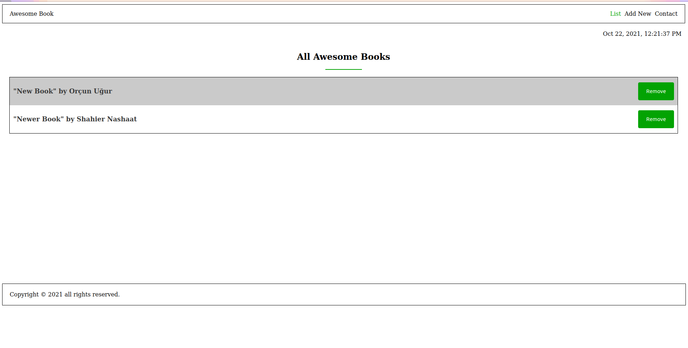

# Project Name

> In this project we created a project that allows users to store books with the name of the book and the name of the author.

## Built With

- HTML&CSS.
- JavaScript.
- Browser Developer Tools.

## Live Demo

[Live Demo Link](https://shahiernashaat.github.io/awesome-books/)

## Getting Started

To get a local copy up and running follow these simple example steps.

- git clone git@github.com:ShahierNashaat/awesome-books.git
- cd into awesome-books file
- Open with Browser or one of the note editor to edit.

### Prerequisites

- Web Browser

## Authors

👤 **Shahier Nashaat**

- GitHub: [@githubhandle](https://github.com/ShahierNashaat)
- Twitter: [@twitterhandle](https://twitter.com/ShahierN)
- LinkedIn: [LinkedIn](https://www.linkedin.com/in/shahier-nashaat-73519313a/)

👤 **Orçun Uğur**

- GitHub: [@githubhandle](https://github.com/luftedar)
- Twitter: [@twitterhandle](https://twitter.com/OrcunUgur2)
- LinkedIn: [LinkedIn](https://linkedin.com/in/orçun-uğur-089148181/)

## 🤝 Contributing

Contributions, issues, and feature requests are welcome!

Feel free to check the [issues page](../../issues/).

## Show your support

Give a ⭐️ if you like this project!

## 📝 License

This project is [MIT](./MIT.md) licensed.
